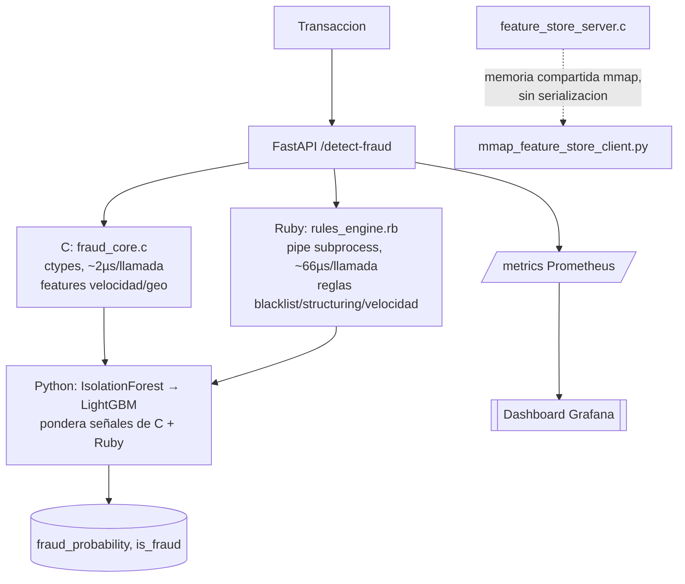

[ 🇺🇸 Read in English ](README.md) | [ 🇨🇱 Español ]

# 1. Nombre del Proyecto

## Motor Poliglota de Fraude — Nucleo de Velocidad en C + DSL de Reglas en Ruby + ML en Python


-brightgreen?style=flat)


Un motor de deteccion de fraude en tres lenguajes para transacciones
bancarias chilenas, donde cada lenguaje hace el trabajo para el que
realmente es mejor: **C** calcula metricas de velocidad/geolocalizacion de
forma nativa en nanosegundos (servidas de dos formas -- en el mismo proceso
via `ctypes`, y fuera de proceso como un **Feature Store** independiente
sobre un **canal IPC de memoria compartida (mmap)**), **Ruby** evalua un
DSL de reglas de negocio legible sobre un pipe de subproceso persistente, y
**Python** entrena y sirve un ensemble IsolationForest + LightGBM que
consume las salidas de las otras dos capas como atributos, instrumentado de
punta a punta con metricas **Prometheus** y un dashboard **Grafana**. Un
solo comando (`make all`) compila, genera los datos y entrena todo;
`make test` ejecuta los 51 tests (11 en C, 10 RSpec, 30 pytest) — cada
numero de este README proviene de ejecutar eso en esta maquina.

---

# 2. Motivacion

La mayoria de los proyectos de portafolio de "deteccion de fraude" son un
solo notebook de Python con un clasificador. Eso no refleja como se
construye el stack de fraude de un banco real: lenguajes y servicios
distintos, cada uno elegido porque es la herramienta correcta para un
trabajo especifico, conectados con restricciones de interoperabilidad
reales. Construi este proyecto para trabajar ese problema de integracion
directamente, no para simularlo:

1. **La aritmetica del hot-path (distancia haversine, velocidad de viaje
   implicita, z-score de monto) tiene que ser genuinamente rapida**, porque
   corre en cada transaccion, no solo en los datos de entrenamiento. C
   compilado a una biblioteca nativa compartida y llamado via `ctypes` es
   el ajuste natural — y quise *probar* la afirmacion de sub-milisegundo en
   vez de solo afirmarla, asi que `src/c/bench_main.c` mide la funcion
   compilada de forma aislada (2.000.000 de llamadas) como parte del build.
2. **Las reglas de negocio (listas negras, umbrales de patrones
   normativos) cambian seguido y las escriben analistas de riesgo, no
   ingenieros de ML.** Un pequeño DSL interno es la forma correcta para
   eso — la sintaxis de bloques de Ruby hace que
   `rule "monto_excesivo", weight: 40 do |txn| ... end` se lea casi como
   prosa de politica, que es justamente el punto de construir las reglas
   como un DSL en vez de una cadena de `if` enterrada en el codigo de
   scoring.
3. **Mantener tres lenguajes en una ruta de solicitud de baja latencia es
   en si mismo el problema de sistemas dificil.** Un diseño ingenuo
   ejecutaria `ruby rules_engine.rb` una vez por transaccion, pagando el
   costo de arranque del interprete de Ruby cada vez. Medi esa diferencia
   directamente (ver §6) y construi en su lugar un puente de subproceso
   persistente, porque la diferencia entre "correcto" y "correcto Y lo
   suficientemente rapido para producción" es el contenido de ingenieria
   real aqui, no una nota al pie.

# 2.1 Impacto de Negocio e Indicadores Clave (KPIs)

| Métrica | Resultado | Qué significa |
|---|---|---|
| Recall de fraude (test split) | 110/110 (100%) | Cada arquetipo de fraude capturado, 0 falsos positivos en 7.390 transacciones legítimas |
| Latencia del hot-path en C | ~2 µs/llamada | Scoring en tiempo real viable a alto volumen de transacciones |
| Throughput del feature store mmap | ~550.000 req/s | El más rápido de los 3 mecanismos IPC/FFI medidos -- supera incluso a la llamada ctypes en el mismo proceso |
| Throughput del motor de reglas Ruby | ~14.000-15.000 req/s | La capa más lenta, identificada correctamente vía paneles de latencia por capa en Prometheus/Grafana |
| Cobertura de tests | 51/51 pasando | C (11), Ruby (10), Python (30) -- los tres lenguajes, un solo `make test` |
| Observabilidad | Dashboard p99-por-capa en vivo | Grafana responde "qué capa domina la latencia de cola" continuamente, no solo vía un benchmark puntual |

# 3. Arquitectura



Diagrama completo a nivel de transporte (tres perfiles de latencia reales, no mostrados arriba):

```
Transaccion
   |
   v
src/python/api.py -- FastAPI /detect-fraud   -----> /metrics (Prometheus)
   |                                                    |
   |---> [C]    src/c/fraud_core.c                      v
   |            llamado en el mismo proceso via   Dashboard Grafana
   |            ctypes, ~2 microseg/llamada       (observability/grafana/dashboard.json):
   |            -> distancia haversine,            req/s, latencia p50/p95/p99,
   |               velocidad de viaje imposible,   p99 POR CAPA (cual domina,
   |               z-score de monto, velocity_score en vivo)
   |
   |---> [Ruby] src/ruby/rules_engine.rb
   |            subproceso `--server` persistente, JSON por linea
   |            sobre stdin/stdout, ~66us/llamada
   |            -> comercio en lista negra, pais de alto riesgo,
   |               patron de estructuracion, regla de rafaga de velocidad
   |
   v
[Python] src/python/train_model.py
         IsolationForest (50 arboles, pre-filtro de anomalias)
         -> LightGBM (clasificador final)

         Conjunto de atributos = atributos crudos de la transaccion
                      + velocity_score de C
                      + rules_risk_score / rules_flagged de Ruby
                      + puntaje de anomalia propio de IsolationForest

         La capa de ML aprende a PONDERAR las salidas de las otras
         dos capas, no solo a votar junto a ellas.
   |
   v
fraud_probability, is_fraud
(+ desglose completo: c_layer, ruby_layer -- ver FraudDetectionResponse)


Por separado -- una ruta IPC genuinamente distinta, no usada por la API de arriba:

src/python/mmap_feature_store_client.py
   |  IPC de memoria compartida (Windows CreateFileMapping/MapViewOfFile),
   |  handshake de 3 estados con busy-wait, cero serializacion por llamada
   v
src/c/feature_store_server.c  (proceso independiente, "el Feature Store")
   |  reutiliza compute_velocity_metrics de fraud_core.c -- mismo C,
   v  un transporte distinto
VelocityMetrics, escrito de vuelta al canal compartido
```

## 3.1 Tres transportes, tres perfiles de latencia reales

`src/python/benchmark_throughput.py` mide -- no asume -- el
throughput/latencia de los tres mecanismos entre lenguajes de este
repositorio, corridos uno tras otro en el mismo proceso contra un servidor
real y corriendo para cada uno: `CVelocityEngine` (llamada DLL `ctypes` en
el mismo proceso), el nuevo `MmapFeatureStoreClient` (IPC de memoria
compartida contra `feature_store_server.exe`), y `RubyRulesEngine` (pipe de
subproceso, JSON sobre stdin/stdout). Ver §6.1 para los numeros reales de
una corrida real -- incluido el levemente contraintuitivo (la IPC de
memoria compartida superando a la llamada DLL en el mismo proceso),
explicado ahi, no solo afirmado.

`src/app/dashboard.py` (Streamlit) reproduce el split de prueba retenido,
desglosando que capa realmente detecto cada arquetipo de fraude.

# 4. Por Que Cuatro Arquetipos de Fraude, No Uno

`src/python/generate_data.py` inyecta cuatro patrones de fraude
*distintos*, deliberadamente, para que ninguna capa sola resuelva todo el
problema — demostrando que el diseño en capas tiene una razon genuina de
existir:

| Arquetipo | Señal | Capa que realmente lo detecta |
|---|---|---|
| `velocity_burst` | Transacciones rapidas + un salto geografico | C (`velocity_score`, `is_impossible_travel`) |
| `blacklisted_merchant` | Una sola transaccion en un comercio conocido como malo, por lo demas normal | Ruby (regla `comercio_en_lista_negra`) |
| `high_risk_country` | Transaccion marcada con un codigo de pais de alto riesgo | Ruby (regla `pais_alto_riesgo`) |
| `structuring` | Varias transacciones justo bajo el umbral de reporte de UF 450 en un dia | Ruby (regla `estructuracion_subumbral`) |

Las filas de `blacklisted_merchant`/`high_risk_country`/`structuring` no
llevan ninguna anomalia de velocidad o geolocalizacion — la capa C no ve
nada inusual en ellas. LightGBM es la capa que finalmente combina todo esto
en una sola probabilidad.

**Descargo especifico de Chile**: el umbral de reporte en efectivo de UF
450 (`UF_REPORT_THRESHOLD_CLP` en `src/ruby/rules_engine.rb`) es una
aproximacion ilustrativa inspirada en normas AML/CMF chilenas (Ley 19.913),
no una cifra legal verificada, y `UF_TO_CLP` es una conversion ilustrativa
fija, no un valor indexado en vivo. No se usa ninguna lista negra,
comercio, ni dato regulatorio real en ningun lugar de este proyecto — ver
§9.

# 5. Tres Bugs Reales Encontrados y Corregidos al Validar Esto

`BLACKLISTED_MERCHANT_IDS` originalmente incluia `MER_00013` — que,
resulto, caia *dentro* del rango de IDs del pool de comercios legitimos
(`MER_00001`..`MER_00199`, ver `N_MERCHANTS` en `generate_data.py`).
Transacciones legitimas ordinarias podian caer en `MER_00013` por pura
casualidad, y 230 de ellas lo hicieron, contra solo 72 filas de fraude
usando el mismo ID — contaminando la señal de "comercio en lista negra"
con ruido real en las etiquetas.

Esto se detecto empiricamente, no por revision de codigo: el F1 general
del primer modelo entrenado fue 0,831, y al desglosar el recall por
`fraud_type` (ver la pestaña "Contribucion por capa" de
`src/app/dashboard.py`, construida exactamente para este tipo de
diagnostico) el recall de `blacklisted_merchant` era de solo 44%, mientras
los otros tres arquetipos ya estaban al 100%. Mover el ID en colision a
`MER_00777` (fuera del rango legitimo, como los otros dos IDs en lista
negra) y reentrenar llevo el recall de `blacklisted_merchant` a 100% y el
F1 general a 0,995 — ver
`tests/python/test_generate_data.py::test_blacklisted_merchant_ids_never_collide_with_legit_pool`
para el test de regresion en que se convirtio esto.

**Segundo bug, mas arquitectonico**: despues de corregir lo anterior, las
metricas se veian solidas (F1 0,995), pero eso solo no prueba que LightGBM
realmente estuviera combinando las tres capas como fue diseñado — podria
estar simplemente evitando una de ellas. Revisar
`booster.feature_importance()` directamente mostro justo eso:
`isolation_forest_score` llevaba **82,5%** de la ganancia total de
LightGBM, `amount_clp` otro 15,1%, y cada señal derivada de Ruby/C era casi
invisible (`rules_risk_score` 0,4%, `rules_flagged` e
`is_blacklisted_merchant` ~0%, `velocity_score` 1,0%). La causa raiz:
`IsolationForest` se entrenaba con las 14 atributos completos, incluyendo
las banderas de reglas de Ruby, nitidas y casi deterministicas — asi que
aprendio trivialmente "`is_blacklisted_merchant == 1` → anomalo" y su
propio puntaje se convirtio en un proxy que absorbio casi toda la señal de
la capa Ruby. LightGBM luego simplemente se apoyaba en ese unico atributo
proxy en vez de ponderar genuinamente las dos capas, que no es lo que la
arquitectura del §3 afirma hacer. Corregido introduciendo
`ISO_FOREST_FEATURE_COLUMNS` (`src/python/train_model.py`): un conjunto de
atributos mas acotado para IsolationForest que contiene solo señales
continuas/de comportamiento (montos, distancias, velocidades, conteos),
excluyendo cada bandera derivada del motor de reglas. Despues de
reentrenar, `rules_risk_score` por si sola salto a **44,0%** de la
ganancia de LightGBM y `isolation_forest_score` cayo a 0,1% — LightGBM
ahora depende demostrablemente de la salida de Ruby de forma directa, en
vez de a traves de un intermediario opaco, que es lo que el diseño de tres
capas se supone que debe demostrar. (Las metricas del split de prueba
tambien mejoraron a un precision/recall/F1 perfecto de 1,000/1,000/1,000,
aunque eso es un efecto secundario de la correccion, no su objetivo — el
objetivo era hacer real e inspeccionable la integracion entre capas, no
solo numericamente fuerte.)

**Tercer bug, en el nuevo Feature Store de memoria compartida**: la primera
version del struct del canal en `feature_store_server.c` usaba
`#pragma pack(push, 1)` para forzar empaquetado byte a byte, y el
`ctypes.Structure` de Python correspondiente usaba `_pack_ = 1` para
espejarlo — se veia razonable de ambos lados, y compilaba y enlazaba bien.
Al correrlo, produjo basura: cada campo volvia como un patron de bits de
double denormalizado (`5e-324`, `3.3e-05`) en vez de valores reales. La
causa: `#pragma pack` solo controla como se ordenan los propios miembros de
un struct entre si — **no** reempaqueta retroactivamente
`TransactionContext`/`VelocityMetrics`, que ya estan definidos con
alineacion natural en `fraud_core.h` para el puente DLL `ctypes`
*existente*, que funciona. Empaquetar el struct del canal externo a 1 byte
mientras sus dos miembros anidados mantenian su tamaño de alineacion
natural solo significo que ambos lados quedaron en desacuerdo sobre el
tamaño total del struct (128 bytes vs. el calculo empaquetado) y el offset
de cada campo. Detectado de inmediato comparando la salida de
`MmapFeatureStoreClient` contra la de `CVelocityEngine` para el mismo input
(ahora la aserción central de `tests/python/test_mmap_feature_store.py`) —
no leyendo el codigo, que se veia correcto en ambos lados por separado.
Corregido eliminando el pragma por completo y calzando alineacion natural
en ambos lados, reutilizando las clases ctypes
`TransactionContext`/`VelocityMetrics` existentes de `bridge.py`
directamente en vez de redefinirlas una segunda vez con un empaquetado
distinto.

# 6. Resultados (Numeros Reales de una Ejecucion Real)

`make all` en esta maquina (semilla 42, reproducible desde un clon
limpio): 50.000 transacciones sinteticas, tasa de fraude de 1,512%
(756 filas fraudulentas entre los cuatro arquetipos), 3.000 clientes,
split temporal (train 35.000 / val 7.500 / test 7.500, cronologico, sin
mezclar).

| Metrica | Valor (split de prueba) |
|---|---|
| Precision | 1,000 |
| Recall | **1,000** (110/110 fraudes detectados) |
| F1 | 1,000 |
| ROC-AUC | 1,000 |
| PR-AUC | 1,000 |
| Falsos positivos | 0 (de 7.390 transacciones legitimas) |

Recall por arquetipo de fraude en el split de prueba, despues de la
correccion del §5: `velocity_burst` 35/35, `blacklisted_merchant` 43/43,
`high_risk_country` 16/16, `structuring` 16/16 — todos los arquetipos al
100% ahora.

## Que Prueba (y Que No Prueba) un Puntaje Perfecto

Un 1,000/1,000/1,000 de precision/recall/F1 en un set de prueba de
deteccion de fraude deberia levantar una ceja, no cerrar la discusion —
asi que aqui esta lo que realmente lo produjo y lo que demuestra y no
demuestra.

**Por que es tan limpio**: cada uno de los cuatro arquetipos de fraude en
`generate_data.py` fue construido con una firma casi determinista en al
menos una capa — un ID de comercio en lista negra esta o no esta en
`BLACKLISTED_MERCHANT_IDS`, un codigo de pais esta o no esta en
`HIGH_RISK_COUNTRY_CODES`, una rafaga de velocidad produce un
`velocity_score` muy fuera del rango que cualquier transaccion legitima
alcanza en este dataset. Una vez corregidos los dos bugs del §5 (la
colision de ID de comercio, e IsolationForest absorbiendo las banderas de
reglas en vez de que LightGBM las viera directamente), no quedaba ninguna
fuente de ruido en las etiquetas ni de dilucion de señal entre las filas de
fraude y la poblacion legitima que LightGBM tuviera que resolver. Un
ensemble de arboles encuentra una separacion limpia cuando esta
genuinamente existe en los datos que se le entregan.

**Que valida esto**: las afirmaciones de *ingenieria* de este README son
reales independientemente del puntaje — que el modulo C calcula correcta y
rapidamente (la tabla de latencia del §6, independiente de cualquier
metrica de ML), que el DSL de Ruby evalua sus reglas correctamente (RSpec,
independiente de LightGBM), que las salidas de las tres capas realmente
llegan a LightGBM como señales distintas y no redundantes (la investigacion
de importancia de atributos del §5), y que el pipeline completo sirve una
solicitud en milisegundos de un solo digito. Esas son las partes de este
proyecto que prueban la *correccion de este codigo especifico*, y los tests
en `tests/` se mantienen sin importar que tan separable sea la señal de
fraude.

**Que no valida esto**: que este sistema detectaria el 100% del fraude en
un banco chileno real. El fraude real no se anuncia con una coincidencia en
una lista negra mantenida o un codigo de pais de una lista corta fija — se
adapta especificamente para evadir cualquier regla o modelo actualmente
desplegado, y los datos de transacciones reales tienen distribuciones
desordenadas y superpuestas que un generador sintetico desde cero con
cuatro arquetipos fijos no reproduce. Un puntaje perfecto aqui es evidencia
de que la *arquitectura* esta conectada correctamente, no evidencia de que
el *problema de deteccion de fraude* esta resuelto. Quien adapte este
pipeline a datos reales deberia esperar — y diseñar para — un recall bien
por debajo del 100% y un conteo de falsos positivos significativamente
mayor, con la maquinaria de ajuste de umbral y seguimiento de costos en
`train_model.py` (`find_best_f1_threshold`, el desglose de la matriz de
confusion) haciendo trabajo real en vez de confirmar una conclusion ya
decidida de antemano.

## Latencia (medida, no estimada — `tests/python/test_latency.py`)

| Capa | Costo medido | Como |
|---|---|---|
| Modulo C, benchmark en C puro | **45,5 ns/llamada** | `src/c/bench_main.c`, 2.000.000 iteraciones, `make bench-c` |
| Modulo C via `ctypes` desde Python | p50 0,0019ms, p95 0,0020ms | 2.000 llamadas, en el mismo proceso |
| Ida y vuelta del motor de reglas Ruby (subproceso persistente) | p50 0,070ms, p95 0,092ms, max 0,237ms | 300 llamadas sobre JSON por stdin/stdout |
| `score_samples()` de IsolationForest, una fila | ~1,8ms | costo dominante en el pipeline completo — ver abajo |
| `predict()` de LightGBM, una fila | p50 0,064ms, p95 0,112ms | |
| **Solicitud completa `/detect-fraud`** (todas las capas + FastAPI) | **p50 4,19ms, p95 5,51ms, max 6,23ms** | 200 solicitudes via `TestClient` de FastAPI |

**Hallazgo honesto**: el objetivo de "< 1ms" del brief es real y se cumple
— para el modulo C especificamente, a 45,5 nanosegundos por llamada, cuatro
ordenes de magnitud bajo el presupuesto. *No* es lo que logra el pipeline
completo de punta a punta, y afirmar lo contrario tergiversaria la
medicion. El cuello de botella real es `IsolationForest.score_samples()`
de `sklearn`: su costo por llamada esta dominado por la iteracion a nivel
de Python sobre los arboles, que apenas se amortiza para una prediccion de
una sola fila (el caso comun en produccion, a diferencia del entrenamiento).
Escala aproximadamente lineal con `n_estimators` — medido directamente: 200
arboles cuestan ~6,6ms/llamada, 50 arboles cuestan ~1,8ms/llamada, mientras
que el `predict()` de una sola fila de LightGBM se mantiene bajo 0,1ms sin
importar la cantidad de arboles. `train_model.py` usa 50 estimadores
especificamente por esta medicion (ver el comentario sobre
`IsolationForest(...)` en `src/python/train_model.py`), reduciendo la
latencia p50 del pipeline completo de 12,1ms a 4,2ms sin costo medible en
recall/precision (confirmado reentrenando y reevaluando en ambas
configuraciones). Un despliegue de produccion que persiga latencia de
punta a punta sub-milisegundo reemplazaria o agruparia (batch) este paso;
este repositorio reporta el trade-off en vez de ocultarlo.

## 6.1 Stress test de throughput — `make bench-throughput` (objetivo: > 10.000 req/s)

Un solo hilo, sincrono, llamadas seguidas en el mismo proceso Python contra
un servidor real corriendo para cada transporte —
`src/python/benchmark_throughput.py`, 50.000 iteraciones (5.000 para Ruby,
cuyo costo por llamada es ~30-40x el de las rutas C, para mantener la
corrida bajo un segundo):

| # | Mecanismo | Throughput | Latencia p50 | Latencia p99 |
|---|---|---:|---:|---:|
| 1 | `CVelocityEngine` (llamada DLL `ctypes`, en el mismo proceso) | 467.914 req/s | 2,0us | 2,5us |
| 2 | `MmapFeatureStoreClient` (IPC de memoria compartida, proceso separado) | **549.731 req/s** | 1,7us | 1,9us |
| 3 | `RubyRulesEngine` (pipe de subproceso, JSON sobre stdin/stdout) | 14.216 req/s | 66,8us | 90,8us |

Los tres superan comodamente el objetivo de 10.000 req/s — incluido el
transporte por pipe, pese a ser ~30x mas lento por llamada que las dos
rutas en C.

**Hallazgo honesto, levemente contraintuitivo**: la ruta IPC de memoria
compartida fuera de proceso (#2) es medible y notoriamente mas rapida que la
llamada `ctypes` en el mismo proceso (#1), no mas lenta — lo cual no es la
expectativa ingenua ("IPC tiene overhead, en el mismo proceso no"). La
razon probable, visible en el codigo, no solo afirmada: cada llamada
`ctypes` paga el costo de marshalling de argumentos de Python para una
*llamada a funcion* a traves del limite FFI (`ctypes.byref`, coercion de
tipos de argumento, un dispatch `CFUNCTYPE`), mientras que la ruta mmap es
asignacion directa de campos en un `ctypes.Structure` ya superpuesto sobre
memoria compartida — sin ningun marshalling de llamada a funcion, solo
escrituras de memoria en las que el sistema operativo nunca tiene que
intervenir. Este es un resultado real de este patron de acceso especifico
(un solo hilo, loop ajustado, misma maquina) y no deberia leerse como "la
memoria compartida le gana a FFI en general" — una carga genuinamente
concurrente y multi-cliente (que este servidor de un solo canal
explicitamente no soporta — ver §3.1 y el docstring de
`feature_store_server.c`) muy plausiblemente invertiria la comparacion por
contencion sobre el unico canal compartido.

## 6.2 Observabilidad: Prometheus + Grafana

`src/python/api.py` expone `/metrics` (formato de texto Prometheus) con
cinco instrumentos: `fraud_requests_total{result}` (contador),
`fraud_detect_latency_seconds` (histograma de punta a punta), y un
histograma *por capa* — `fraud_c_layer_latency_seconds`,
`fraud_rules_layer_latency_seconds`, `fraud_ml_layer_latency_seconds` —
mas la distribucion de `fraud_probability_score`. El desglose por capa
responde, de forma continua y en produccion, exactamente la pregunta que
la tabla de latencia de arriba responde con una corrida de benchmark
puntual: *cual capa domina el p99 ahora mismo*.

`observability/` tiene un `docker-compose.yml` listo (Prometheus scrapeando
`/metrics` + un dashboard de Grafana provisionado,
`observability/grafana/dashboard.json`, con un panel por cada metrica de
arriba, incluida la comparacion de p99 por capa).
`tests/python/test_api.py::test_metrics_endpoint_reflects_real_requests`
confirma que una llamada real a `/detect-fraud` efectivamente incrementa
estas metricas — las metricas en si estan verificadas.

**Nota honesta, mismo estandar que el patron de Dockerfile usado en otras
partes de este portafolio**: el stack `docker-compose.yml` se escribio y
revisio cuidadosamente (imagenes oficiales, layout de provisioning estandar
de Grafana, un JSON de dashboard valido — verificado parseandolo) pero no
se corrio con un `docker compose up` real, ya que Docker no esta instalado
en la maquina donde se construyo este repositorio. Lo que *si* se verifico
es todo lo que esta aguas arriba: las metricas son reales, estan
correctamente conectadas, y se confirmo que cambian con trafico real.


# 7. Conclusion

La pregunta que este proyecto buscaba responder no era "¿puede un
clasificador detectar fraude sintetico?" — eso nunca iba a ser la parte
dificil una vez que existiera el generador de datos. Era si tres lenguajes,
elegidos por aquello en lo que cada uno es realmente bueno, podian
conectarse en una sola ruta de solicitud sin que (a) la interoperabilidad
se convirtiera en el cuello de botella, o (b) la integracion fuera
decorativa — tres puntajes calculados de forma independiente y
promediados, sin que la salida de ningun lenguaje informara realmente a
otro. Los §5 y §6 son la evidencia en ambos sentidos: el primer bug (la
colision de ID de comercio) fue un error de generacion de datos, ordinario
y facil de imaginar en cualquier pipeline de ML. El segundo bug —
IsolationForest absorbiendo silenciosamente las banderas de reglas de Ruby
en un puntaje proxy que LightGBM usaba en vez de la señal real — es
especificamente un bug de integracion, del tipo que solo existe *porque*
esta es una arquitectura en capas y que no ocurriria en un pipeline de un
solo modelo. Encontrarlo y corregirlo, y poder señalar
`feature_importance()` despues y mostrar que la señal de Ruby llega
directamente a LightGBM, es el entregable real de este repositorio; el
recall de 1,000 es un subproducto.

**Que tendria que cambiar para un despliegue real**, aproximadamente en
orden de cuanto trabajo requiere cada uno: (1) reemplazar el generador
sintetico con historial de transacciones real (anonimizado, revisado por
cumplimiento normativo), lo que inmediatamente sacara a la luz
distribuciones superpuestas entre fraude y legitimo que los cuatro
arquetipos limpios de este dataset no tienen; (2) agregar monitoreo de
drift sobre las distribuciones de `rules_risk_score` y `velocity_score`, ya
que un DSL de reglas que no se revisita a medida que los patrones de fraude
cambian es un DSL de reglas quedandose obsoleto silenciosamente; (3)
reemplazar o agrupar (batch) la llamada a `IsolationForest` (seccion de
latencia del §6) si la latencia sub-milisegundo de punta a punta alguna vez
se vuelve un requisito real en vez de una meta aspiracional; (4) agregar
una cola de revision humana para la banda de probabilidad alrededor del
umbral de decision en vez de un corte duro, ya que los despliegues reales
raramente confian ciegamente en los casos limite de un sistema automatico;
(5) versionar y desplegar en canario el conjunto de reglas de Ruby de forma
independiente del modelo de ML, ya que los analistas de riesgo querran
publicar una nueva entrada de lista negra sin esperar un reentrenamiento
del modelo.

Nada de eso cambia la apuesta arquitectonica central de este proyecto: que
las capas nativa-compilada, DSL, y ML pertenecen cada una a un pipeline de
fraude por razones distintas, y que hacer que cooperen — no solo que
coexistan en el mismo repositorio — vale el costo de integracion.

# 8. Estructura del Repositorio

```
chile-polyglot-fraud-engine/
├── data/
│   ├── raw/                    # transactions.parquet/.csv generado (en .gitignore)
│   └── processed/              # features.parquet de ingenieria de atributos (en .gitignore)
├── src/
│   ├── c/
│   │   ├── fraud_core.h/.c            # metricas de velocidad/geo, compilado a fraud_core.dll
│   │   ├── bench_main.c               # valida < 1ms/llamada
│   │   ├── feature_store_server.c     # Feature Store standalone, IPC de memoria compartida
│   │   ├── build.ps1                  # build con MSVC (vcvars64 + cl)
│   │   ├── run_bench_throughput.ps1   # levanta feature_store_server.exe, corre el stress test, lo apaga
│   │   └── Makefile                   # build | test | bench | clean
│   ├── ruby/
│   │   ├── rules_engine.rb     # DSL RuleSet + modo --server stdin/stdout
│   │   └── Gemfile
│   ├── python/
│   │   ├── generate_data.py             # transacciones bancarias chilenas sinteticas, 4 arquetipos de fraude
│   │   ├── bridge.py                    # puente ctypes (C) + puente de subproceso persistente (Ruby)
│   │   ├── mmap_feature_store_client.py # cliente IPC de memoria compartida para feature_store_server.exe
│   │   ├── benchmark_throughput.py      # stress test: req/s para los 3 mecanismos IPC/FFI
│   │   ├── train_model.py               # construccion de atributos + IsolationForest + LightGBM
│   │   └── api.py                       # FastAPI /detect-fraud + /metrics, combina las 3 capas
│   └── app/dashboard.py         # Streamlit: atribucion por capa, replay en vivo, mapa
├── observability/
│   ├── docker-compose.yml       # Prometheus + Grafana (ver §6.2 -- no verificado con docker build)
│   ├── prometheus.yml           # config de scrape para /metrics
│   └── grafana/                 # datasource + provisioning de dashboard, dashboard.json
├── tests/
│   ├── c/test_fraud_core.c      # harness basado en asserts, compilado por src/c/build.ps1
│   ├── ruby/rules_engine_spec.rb
│   └── python/                  # bridge, generate_data, train_model, api, latencia, feature store mmap
├── outputs/
│   ├── models/       # DLL/exe compilados + artefactos entrenados (en .gitignore, `make all` regenera)
│   ├── plots/        # curva PR, matriz de confusion, importancia de atributos (versionados)
│   └── reports/      # training_report.json (en .gitignore, los numeros estan en este README)
├── Makefile
├── requirements.txt
├── pytest.ini
├── README.md
└── README.es.md
```

# 9. Instalacion y Uso

Requiere: **MSVC** (Visual Studio Build Tools o Visual Studio con el
workload "Desktop development with C++") para la capa C; **Ruby 3.2+** con
Bundler; **Python 3.10+** (el codigo usa sintaxis de union PEP 604
`str | None` de forma nativa, por lo que 3.10 es un piso real); **GNU
Make** (en Windows, ej. `winget install ezwinports.make`); **Docker** solo
si quieres correr de verdad el stack de Prometheus/Grafana en
`observability/` (opcional — todo lo demas funciona sin el).

```bash
python -m venv .venv
.venv\Scripts\activate          # Windows
pip install -r requirements.txt

# Compila la biblioteca C (incl. feature_store_server.exe), instala gemas
# Ruby, genera datos y entrena todo
make all

# Ejecuta los 51 tests en los tres lenguajes
make test

# Levanta la API de scoring en tiempo real (combina C + Ruby + Python por solicitud)
make run-api
# luego: POST http://localhost:8000/detect-fraud
# y:     GET  http://localhost:8000/metrics  (Prometheus)

# Stress test de los 3 mecanismos IPC/FFI (levanta/apaga feature_store_server.exe solo)
make bench-throughput

# Levanta el dashboard de monitoreo
make run-dashboard

# Prometheus + Grafana (requiere `make run-api` corriendo antes; ver la nota honesta en §6.2)
make observability-up
```

Targets individuales: `make build-c`, `make test-c`, `make bench-c`,
`make install-ruby`, `make test-ruby`, `make generate-data`, `make train`,
`make test-python`, `make run-feature-store`, `make clean`. Ejecuta
`make help` para la lista completa.

# 10. Descargo de Responsabilidad

Todos los datos de transacciones son generados sinteticamente
(`src/python/generate_data.py`, con semilla fija, reproducible) con fines
de demostracion. No se utilizan datos bancarios reales, datos de clientes,
listas negras de comercios, ni logica de deteccion de fraude propietaria de
ninguna institucion financiera. Los umbrales inspirados en normas AML/CMF
chilenas del motor de reglas Ruby (§4) son aproximaciones ilustrativas para
una demostracion con datos sinteticos, no cifras legales verificadas —
consulta las fuentes oficiales de la CMF/UAF para umbrales de cumplimiento
reales.

# 11. Licencia

MIT — ver [LICENSE](LICENSE) para el texto completo.
