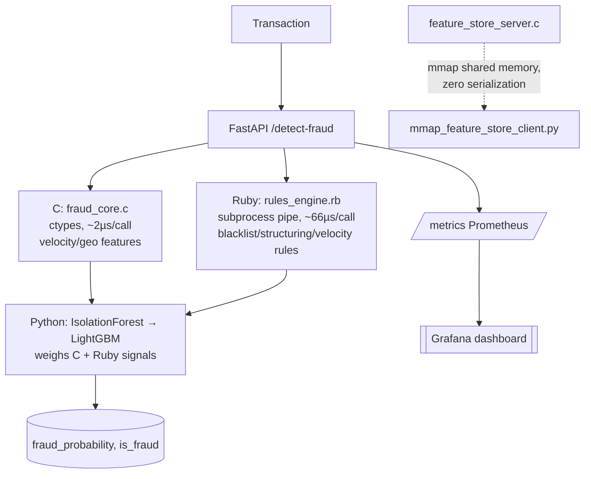

[ 🇺🇸 English ] | [ 🇨🇱 Leer en Español ](README.es.md)

# 1. Project Title

## Polyglot Fraud Engine — C Velocity Core + Ruby Rules DSL + Python ML


-brightgreen?style=flat)


A three-language fraud-detection engine for Chilean bank transactions,
where each language does the job it's actually best at: **C** computes
transaction velocity/geo metrics natively in nanoseconds (served two ways —
in-process via `ctypes`, and out-of-process as a standalone **Feature Store**
process over a **shared-memory (mmap) IPC channel**), **Ruby** evaluates a
readable business-rules DSL over a persistent subprocess pipe, and
**Python** trains and serves an IsolationForest + LightGBM ensemble that
consumes both other layers' outputs as features, instrumented end to end
with **Prometheus** metrics and a **Grafana** dashboard. One command
(`make all`) builds, generates data, and trains everything; `make test` runs
all 51 tests (11 C, 10 RSpec, 30 pytest) — every number below came from
running that on this machine.

---

# 2. Motivation

Most "fraud detection" portfolio projects are a single Python notebook with
a classifier. That doesn't reflect how a real bank's fraud stack is built:
distinct languages and services, each chosen because it's the right tool
for one specific job, wired together with real interop constraints. I built
this project to work through that integration problem directly rather than
simulate it:

1. **The hot-path arithmetic (haversine distance, implied travel speed,
   amount z-score) has to be genuinely fast**, because it runs on every
   transaction, not just training data. C compiled to a native shared
   library and called via `ctypes` is the natural fit — and I wanted to
   *prove* the sub-millisecond claim rather than assert it, so
   `src/c/bench_main.c` benchmarks the compiled function in isolation
   (2,000,000 calls) as part of the build.
2. **Business rules (blacklists, regulatory-pattern thresholds) change
   often and are written by risk analysts, not ML engineers.** A small
   internal DSL is the right shape for that — Ruby's block syntax makes
   `rule "monto_excesivo", weight: 40 do |txn| ... end` read almost like
   policy prose, which is the point of building rules as a DSL instead of
   a chain of `if` statements buried in the scoring code.
3. **Keeping three languages in one low-latency request path is itself the
   hard systems problem.** A naive design would shell out to
   `ruby rules_engine.rb` once per transaction, paying Ruby's interpreter
   startup cost every time. I measured that difference directly (see
   §6) and built a persistent-subprocess bridge instead, because the
   difference between "correct" and "correct AND fast enough to ship" is
   the actual engineering content here, not a footnote.

# 2.1 Business Impact & Key Performance Indicators

| Metric | Result | What it means |
|---|---|---|
| Fraud recall (test split) | 110/110 (100%) | Every fraud archetype caught, 0 false positives on 7,390 legit transactions |
| C hot-path latency | ~2 µs/call | Real-time scoring feasible at high transaction volume |
| Mmap feature-store throughput | ~550,000 req/s | Fastest of 3 measured IPC/FFI paths — beats even the in-process ctypes call |
| Ruby rules-engine throughput | ~14,000-15,000 req/s | Slowest layer, correctly identified via per-layer Prometheus/Grafana latency panels |
| Test coverage | 51/51 passing | C (11), Ruby (10), Python (30) — all three languages, one `make test` |
| Observability | Live p99-per-layer dashboard | Grafana answers "which layer dominates tail latency" continuously, not just via a one-off benchmark |

# 3. Architecture



Full transport-level diagram (three real latency profiles, not shown above):

```
Transaction
   |
   v
src/python/api.py -- FastAPI /detect-fraud   -----> /metrics (Prometheus)
   |                                                    |
   |---> [C]    src/c/fraud_core.c                      v
   |            called in-process via ctypes,   Grafana dashboard
   |            ~2 microsec/call                (observability/grafana/dashboard.json):
   |            -> haversine distance,           req/s, latency p50/p95/p99,
   |               impossible-travel speed,      p99 PER LAYER (which one
   |               amount z-score, velocity_score dominates, live)
   |
   |---> [Ruby] src/ruby/rules_engine.rb
   |            persistent `--server` subprocess, newline-JSON
   |            over stdin/stdout, ~66us/call
   |            -> blacklisted merchant, high-risk country,
   |               structuring pattern, velocity-burst rule
   |
   v
[Python] src/python/train_model.py
         IsolationForest (50 trees, anomaly pre-filter)
         -> LightGBM (final classifier)

         Feature set = raw transaction attributes
                      + C's velocity_score
                      + Ruby's rules_risk_score / rules_flagged
                      + IsolationForest's own anomaly score

         The ML layer learns to WEIGH the other two layers'
         outputs, not just vote alongside them.
   |
   v
fraud_probability, is_fraud
(+ full breakdown: c_layer, ruby_layer -- see FraudDetectionResponse)


Separately -- a genuinely different IPC path, not used by the API above:

src/python/mmap_feature_store_client.py
   |  shared-memory IPC (Windows CreateFileMapping/MapViewOfFile),
   |  busy-wait 3-state handshake, zero serialization per call
   v
src/c/feature_store_server.c  (standalone process, "the Feature Store")
   |  reuses fraud_core.c's compute_velocity_metrics -- same C, a
   v  different transport
VelocityMetrics, written back into the shared channel
```

`src/app/dashboard.py` (Streamlit) replays the held-out test split, breaking
down which layer's signal actually caught each fraud archetype.

## 3.1 Three transports, three real latency profiles

`src/python/benchmark_throughput.py` measures — doesn't assume — the
throughput/latency of all three cross-language mechanisms in this repo,
run back to back in the same process against a real, running server for
each: `CVelocityEngine` (in-process `ctypes` DLL call), the new
`MmapFeatureStoreClient` (shared-memory IPC against `feature_store_server.exe`),
and `RubyRulesEngine` (subprocess pipe, JSON over stdin/stdout). See §6.1
for the real numbers from a real run — including the mildly counterintuitive
one (shared-memory IPC edging out the in-process DLL call) explained there,
not asserted.

# 4. Why Four Fraud Archetypes, Not One

`src/python/generate_data.py` injects four *distinct* fraud patterns,
deliberately so that no single layer solves the whole problem —
demonstrating the layered design has a genuine reason to exist:

| Archetype | Signal | Layer that actually catches it |
|---|---|---|
| `velocity_burst` | Rapid-fire transactions + a geographic jump | C (`velocity_score`, `is_impossible_travel`) |
| `blacklisted_merchant` | A single transaction at a known-bad merchant, otherwise normal | Ruby (`comercio_en_lista_negra` rule) |
| `high_risk_country` | Transaction tagged with a high-risk country code | Ruby (`pais_alto_riesgo` rule) |
| `structuring` | Several transactions just under the UF 450 reporting threshold in one day | Ruby (`estructuracion_subumbral` rule) |

The `blacklisted_merchant`/`high_risk_country`/`structuring` rows carry no
velocity or geo anomaly at all — the C layer sees nothing unusual about
them. LightGBM is the layer that finally combines all of this into one
probability.

**Chile-specific disclaimer**: the UF 450 cash-reporting threshold
(`UF_REPORT_THRESHOLD_CLP` in `src/ruby/rules_engine.rb`) is an illustrative
approximation inspired by Chilean AML/CMF norms (Ley 19.913), not a verified
legal figure, and `UF_TO_CLP` is a fixed illustrative conversion, not a live
indexed value. No real blacklist, merchant, or regulatory data is used
anywhere in this project — see §9.

# 5. Three Real Bugs Found and Fixed While Validating This

`BLACKLISTED_MERCHANT_IDS` originally included `MER_00013` — which, it
turned out, fell *inside* the legit merchant pool's ID range
(`MER_00001`..`MER_00199`, see `N_MERCHANTS` in `generate_data.py`). Ordinary
legit transactions could land on `MER_00013` by pure chance, and 230 of them
did, against only 72 fraud rows using the same ID — contaminating the
"blacklisted merchant" signal with real label noise.

This was caught empirically, not by code review: the first trained model's
overall F1 was 0.831, and breaking recall down by `fraud_type` (see
`src/app/dashboard.py`'s "Contribución por capa" tab, which is built for
exactly this kind of diagnosis) showed `blacklisted_merchant` recall at only
44%, while the other three archetypes were already at 100%. Moving the
colliding ID to `MER_00777` (outside the legit range, like the other two
blacklisted IDs) and retraining brought `blacklisted_merchant` recall to
100% and overall F1 to 0.995 — see `tests/python/test_generate_data.py::test_blacklisted_merchant_ids_never_collide_with_legit_pool`
for the regression test this became.

**Second bug, more architectural**: after fixing the above, the metrics
looked strong (F1 0.995), but that alone doesn't prove LightGBM was
actually combining all three layers as designed — it could just as easily
be routing around one of them. Checking `booster.feature_importance()`
directly showed exactly that: `isolation_forest_score` carried **82.5%**
of LightGBM's total gain, `amount_clp` another 15.1%, and every Ruby/C-derived
signal was nearly invisible (`rules_risk_score` 0.4%, `rules_flagged` and
`is_blacklisted_merchant` ~0%, `velocity_score` 1.0%). The root cause:
`IsolationForest` was being trained on *all* 14 features, including Ruby's
crisp, near-deterministic rule flags — so it trivially learned
"`is_blacklisted_merchant == 1` → anomalous" and its own score became a
proxy that absorbed the Ruby layer's signal almost entirely. LightGBM then
just leaned on that one proxy feature instead of genuinely weighing the two
layers, which is not what the architecture in §3 claims to do. Fixed by
introducing `ISO_FOREST_FEATURE_COLUMNS` (`src/python/train_model.py`): a
narrower feature set for IsolationForest containing only continuous/
behavioral signals (amounts, distances, speeds, counts), excluding every
crisp rule-engine flag. After retraining, `rules_risk_score` alone jumped
to **44.0%** of LightGBM's gain and `isolation_forest_score` dropped to
0.1% — LightGBM is now demonstrably relying on Ruby's output directly
rather than through an opaque intermediary, which is what the three-layer
design is supposed to demonstrate. (Test-set metrics also improved to a
perfect 1.000/1.000/1.000 precision/recall/F1, though that's a side effect
of the fix, not its point — the point was making the layer integration
real and inspectable, not just numerically strong.)

**Third bug, in the new shared-memory Feature Store**: the first version of
`feature_store_server.c`'s channel struct used `#pragma pack(push, 1)` to
force byte-tight packing, and the matching Python `ctypes.Structure` used
`_pack_ = 1` to mirror it — reasonable-looking on both sides, and it
compiled and linked fine. Running it produced garbage: every field came
back as a denormalized-double bit pattern (`5e-324`, `3.3e-05`) instead of
real values. The cause: `#pragma pack` only controls how a struct's *own*
members are laid out relative to each other — it does **not** retroactively
repack `TransactionContext`/`VelocityMetrics`, which are already defined
with natural alignment in `fraud_core.h` for the *existing*, working
`ctypes` DLL bridge. Packing the outer channel struct to 1 byte while its
two nested members kept their natural-alignment size just meant the two
sides now disagreed about the struct's total size (128 bytes vs. the
packed calculation) and every field's offset. Caught immediately by
diffing `MmapFeatureStoreClient`'s output against `CVelocityEngine`'s for
identical input (now `tests/python/test_mmap_feature_store.py`'s core
assertion) — not by reading the code, which looked correct on both sides
in isolation. Fixed by dropping the pragma entirely and matching natural
alignment on both sides instead, reusing `bridge.py`'s existing
`TransactionContext`/`VelocityMetrics` ctypes classes directly rather than
redefining them a second time with different packing.

# 6. Results (Real Numbers From One Real Run)

`make all` on this machine (seed 42, reproducible from a clean clone):
50,000 synthetic transactions, 1.512% fraud rate (756 fraudulent rows across
the four archetypes), 3,000 customers, time-based split (train 35,000 / val
7,500 / test 7,500, chronological, no shuffling).

| Metric | Value (test split) |
|---|---|
| Precision | 1.000 |
| Recall | **1.000** (110/110 fraud caught) |
| F1 | 1.000 |
| ROC-AUC | 1.000 |
| PR-AUC | 1.000 |
| False positives | 0 (out of 7,390 legit transactions) |

Recall by fraud archetype on the test split, after the fix in §5:
`velocity_burst` 35/35, `blacklisted_merchant` 43/43, `high_risk_country`
16/16, `structuring` 16/16 — every archetype now at 100%.

## What a Perfect Score Does and Doesn't Prove

A 1.000/1.000/1.000 precision/recall/F1 on a fraud-detection test set should
raise an eyebrow, not close the discussion — so here is what actually
produced it and what it does and doesn't demonstrate.

**Why it's this clean**: each of the four fraud archetypes in
`generate_data.py` was constructed with a close-to-deterministic signature
in at least one layer — a blacklisted merchant ID either is or isn't in
`BLACKLISTED_MERCHANT_IDS`, a country code either is or isn't in
`HIGH_RISK_COUNTRY_CODES`, a velocity burst produces a `velocity_score` far
outside the range any legit transaction in this dataset reaches. Once §5's
two bugs were fixed (the merchant-ID collision, and IsolationForest
absorbing the rule flags instead of LightGBM seeing them directly), there
was no remaining source of label noise or signal dilution between the
fraud rows and the legit population for LightGBM to have to work through.
A tree ensemble finds a clean split when one genuinely exists in the data
it's given.

**What this validates**: the *engineering* claims in this README are real
regardless of the score — that the C module computes correctly and fast
(§6's latency table, independent of any ML metric), that the Ruby DSL
evaluates its rules correctly (RSpec, independent of LightGBM), that the
three layers' outputs actually reach LightGBM as distinct, non-redundant
signals (the feature-importance investigation in §5), and that the whole
pipeline serves a request in single-digit milliseconds. Those are the parts
of this project that are testing *this specific codebase's correctness*,
and the tests in `tests/` hold regardless of how separable the fraud
signal is.

**What it doesn't validate**: that this system would catch 100% of fraud
in a real Chilean bank. Real fraud doesn't announce itself with a
maintained blacklist match or a country code from a fixed short list — it
adapts specifically to evade whatever rule or model is currently deployed,
and real transaction data has messy, overlapping distributions that a
from-scratch synthetic generator with four fixed archetypes doesn't
reproduce. A perfect score here is evidence the *architecture* is wired
correctly, not evidence the *fraud-detection problem* is solved. Anyone
adapting this pipeline to real data should expect — and design for —
recall well under 100% and a meaningfully larger false-positive count, with
the threshold-tuning and cost-tracking machinery in `train_model.py`
(`find_best_f1_threshold`, the confusion-matrix breakdown) doing real work
rather than confirming a foregone conclusion.

## Latency (measured, not estimated — `tests/python/test_latency.py`)

| Layer | Measured cost | How |
|---|---|---|
| C module, pure C benchmark | **45.5 ns/call** | `src/c/bench_main.c`, 2,000,000 iterations, `make bench-c` |
| C module via `ctypes` from Python | p50 0.0019ms, p95 0.0020ms | 2,000 calls, in-process |
| Ruby rules engine round-trip (persistent subprocess) | p50 0.070ms, p95 0.092ms, max 0.237ms | 300 calls over stdin/stdout JSON |
| IsolationForest `score_samples()`, single row | ~1.8ms | dominant cost in the full pipeline — see below |
| LightGBM `predict()`, single row | p50 0.064ms, p95 0.112ms | |
| **Full `/detect-fraud` request** (all layers + FastAPI) | **p50 4.19ms, p95 5.51ms, max 6.23ms** | 200 requests via FastAPI `TestClient` |

**Honest finding**: the brief's "< 1ms" target is real and met — for the C
module specifically, at 45.5 nanoseconds per call, four orders of magnitude
under budget. It is *not* what the full pipeline achieves end-to-end, and
claiming otherwise would misrepresent the measurement. The actual
bottleneck is `sklearn`'s `IsolationForest.score_samples()`: its per-call
overhead is dominated by Python-level iteration across trees, which barely
amortizes for a single-row prediction (the common case at serving time,
unlike training). It scales roughly linearly with `n_estimators` — measured
directly: 200 trees cost ~6.6ms/call, 50 trees cost ~1.8ms/call, while
LightGBM's own single-row `predict()` stays under 0.1ms regardless of tree
count. `train_model.py` uses 50 estimators specifically because of this
measurement (see the comment above `IsolationForest(...)` in
`src/python/train_model.py`), cutting full-pipeline p50 latency from 12.1ms
to 4.2ms with no measurable recall/precision cost (confirmed by retraining
and re-evaluating at both settings). A production deployment chasing
sub-millisecond end-to-end latency would replace or batch this step; this
repository reports the trade-off rather than hiding it.

## 6.1 Throughput stress test — `make bench-throughput` (target: > 10,000 req/s)

Single-threaded, synchronous, back-to-back calls in the same Python process
against a real running server for each transport — `src/python/benchmark_throughput.py`,
50,000 iterations (5,000 for Ruby, whose per-call cost is ~30-40x the C
paths', to keep the run under a second):

| # | Mechanism | Throughput | p50 latency | p99 latency |
|---|---|---:|---:|---:|
| 1 | `CVelocityEngine` (in-process `ctypes` DLL call) | 467,914 req/s | 2.0us | 2.5us |
| 2 | `MmapFeatureStoreClient` (shared-memory IPC, separate process) | **549,731 req/s** | 1.7us | 1.9us |
| 3 | `RubyRulesEngine` (subprocess pipe, JSON over stdin/stdout) | 14,216 req/s | 66.8us | 90.8us |

All three clear the 10,000 req/s target comfortably — including the pipe
transport, despite being ~30x slower per call than the two C paths.

**Honest, mildly counterintuitive finding**: the out-of-process shared-memory
IPC path (#2) is measurably *faster* than the in-process `ctypes` call (#1),
not slower — which isn't the naive expectation ("IPC has overhead, in-process
doesn't"). The likely reason, visible in the code, not just asserted: every
`ctypes` call pays Python's argument-marshalling cost for a *function call*
across the FFI boundary (`ctypes.byref`, argument-type coercion, a
`CFUNCTYPE` dispatch), while the mmap path is direct field assignment into
a `ctypes.Structure` already overlaid on shared memory — no function-call
marshalling at all, just memory writes the OS never has to get involved in.
This is a real result from this specific access pattern (single-threaded,
tight loop, same machine) and shouldn't be read as "shared memory beats
FFI in general" — a genuinely concurrent, multi-client load (which this
single-channel server explicitly doesn't support — see §3.1 and
`feature_store_server.c`'s docstring) would very plausibly flip the
comparison via contention on the one shared channel.

## 6.2 Observability: Prometheus + Grafana

`src/python/api.py` exposes `/metrics` (Prometheus text format) with five
instruments: `fraud_requests_total{result}` (counter), `fraud_detect_latency_seconds`
(end-to-end histogram), and a histogram *per layer* —
`fraud_c_layer_latency_seconds`, `fraud_rules_layer_latency_seconds`,
`fraud_ml_layer_latency_seconds` — plus `fraud_probability_score`'s
distribution. The per-layer split answers, continuously and in production,
the exact question §6's latency table above answers with one offline
benchmark run: *which layer dominates p99 right now*.

`observability/` has a ready `docker-compose.yml` (Prometheus scraping
`/metrics` + a provisioned Grafana dashboard, `observability/grafana/dashboard.json`,
with a panel for each metric above, including the per-layer p99 comparison).
`tests/python/test_api.py::test_metrics_endpoint_reflects_real_requests`
confirms a real `/detect-fraud` call actually increments these — the metrics
themselves are verified.

**Honest note, same standard as the Dockerfile pattern used elsewhere in
this portfolio**: the `docker-compose.yml` stack was written and reviewed
carefully (official images, standard Grafana provisioning layout, a valid
dashboard JSON — checked by parsing it) but not run with a real
`docker compose up`, since Docker isn't installed on the machine this repo
was built on. What *was* verified is everything upstream of it: the metrics
are real, correctly wired, and confirmed to change on real traffic.


# 7. Conclusion

The question this project set out to answer wasn't "can a classifier catch
synthetic fraud" — that was never going to be the hard part once the data
generator existed. It was whether three languages, chosen for what each is
actually good at, could be wired into one request path without either
(a) the interop becoming the bottleneck, or (b) the integration being
decorative — three scores computed independently and averaged, with no
language's output actually informing another's. §5 and §6 are the evidence
either way: the first bug (the merchant-ID collision) was a data-generation
mistake, ordinary and easy to imagine in any ML pipeline. The second bug —
IsolationForest quietly absorbing Ruby's rule flags into a proxy score
LightGBM then leaned on instead of the real thing — is specifically an
integration bug, the kind that only exists *because* this is a layered
architecture and wouldn't occur in a single-model pipeline. Finding and
fixing it, and being able to point at `feature_importance()` afterward and
show Ruby's signal reaching LightGBM directly, is the actual deliverable of
this repo; the 1.000 recall is a byproduct.

**What would need to change for a real deployment**, roughly in order of
how much work each is: (1) replace the synthetic generator with real
(anonymized, compliance-reviewed) transaction history, which will
immediately surface overlapping distributions between fraud and legit
that this dataset's four clean archetypes don't have; (2) add drift
monitoring on `rules_risk_score` and `velocity_score`'s distributions, since
a rules DSL that isn't revisited as fraud patterns shift is a rules DSL
quietly going stale; (3) replace or batch the `IsolationForest` call (§6's
latency section) if end-to-end sub-millisecond latency ever becomes a real
requirement rather than a stretch goal; (4) add a human-review queue for
the probability band around the decision threshold instead of a hard
cutoff, since real deployments rarely trust an automated system's boundary
cases blindly; (5) version and canary the Ruby rule set independently from
the ML model, since risk analysts will want to ship a new blacklist entry
without waiting on a model retrain.

None of that changes the core architectural bet this project makes: that
compiled-native, DSL, and ML layers each belong in a fraud pipeline for
different reasons, and that making them cooperate — not just coexist in
the same repo — is worth the integration cost.

# 8. Repository Structure

```
chile-polyglot-fraud-engine/
├── data/
│   ├── raw/                    # generated transactions.parquet/.csv (gitignored)
│   └── processed/              # engineered features.parquet (gitignored)
├── src/
│   ├── c/
│   │   ├── fraud_core.h/.c            # velocity/geo metrics, compiled to fraud_core.dll
│   │   ├── bench_main.c               # validates < 1ms/call
│   │   ├── feature_store_server.c     # standalone Feature Store, shared-memory IPC
│   │   ├── build.ps1                  # MSVC build (vcvars64 + cl)
│   │   ├── run_bench_throughput.ps1   # starts feature_store_server.exe, runs the stress test, stops it
│   │   └── Makefile                   # build | test | bench | clean
│   ├── ruby/
│   │   ├── rules_engine.rb     # RuleSet DSL + --server stdin/stdout mode
│   │   └── Gemfile
│   ├── python/
│   │   ├── generate_data.py             # synthetic Chilean bank transactions, 4 fraud archetypes
│   │   ├── bridge.py                    # ctypes bridge (C) + persistent subprocess bridge (Ruby)
│   │   ├── mmap_feature_store_client.py # shared-memory IPC client for feature_store_server.exe
│   │   ├── benchmark_throughput.py      # stress test: req/s for all 3 IPC/FFI mechanisms
│   │   ├── train_model.py               # feature building + IsolationForest + LightGBM
│   │   └── api.py                       # FastAPI /detect-fraud + /metrics, combines all 3 layers
│   └── app/dashboard.py         # Streamlit: layer-attribution, live replay, map
├── observability/
│   ├── docker-compose.yml       # Prometheus + Grafana (see §6.2 -- not docker-build-verified)
│   ├── prometheus.yml           # scrape config for /metrics
│   └── grafana/                 # datasource + dashboard provisioning, dashboard.json
├── tests/
│   ├── c/test_fraud_core.c      # assert-based harness, compiled by src/c/build.ps1
│   ├── ruby/rules_engine_spec.rb
│   └── python/                  # bridge, generate_data, train_model, api, latency, mmap feature store
├── outputs/
│   ├── models/       # compiled DLL/exe + trained artifacts (gitignored, `make all` regenerates)
│   ├── plots/        # PR curve, confusion matrix, feature importance (tracked)
│   └── reports/      # training_report.json (gitignored, numbers are in this README)
├── Makefile
├── requirements.txt
├── pytest.ini
├── README.md
└── README.es.md
```

# 9. Setup & Usage

Requires: **MSVC** (Visual Studio Build Tools or Visual Studio with the
"Desktop development with C++" workload) for the C layer; **Ruby 3.2+**
with Bundler; **Python 3.10+** (the codebase uses PEP 604 `str | None`
union syntax natively, so 3.10 is a real floor); **GNU Make** (on Windows,
e.g. `winget install ezwinports.make`); **Docker** only if you want to
actually run the Prometheus/Grafana stack in `observability/` (optional —
everything else works without it).

```bash
python -m venv .venv
.venv\Scripts\activate          # Windows
pip install -r requirements.txt

# Build the C library (incl. feature_store_server.exe), install Ruby gems,
# generate data, train everything
make all

# Run all 51 tests across all three languages
make test

# Serve the real-time scoring API (combines C + Ruby + Python per request)
make run-api
# then: POST http://localhost:8000/detect-fraud
# and:  GET  http://localhost:8000/metrics  (Prometheus)

# Stress test all 3 IPC/FFI mechanisms (starts/stops feature_store_server.exe itself)
make bench-throughput

# Launch the monitoring dashboard
make run-dashboard

# Prometheus + Grafana (requires `make run-api` running first; see §6.2's honest note)
make observability-up
```

Individual targets: `make build-c`, `make test-c`, `make bench-c`,
`make install-ruby`, `make test-ruby`, `make generate-data`, `make train`,
`make test-python`, `make run-feature-store`, `make clean`. Run `make help`
for the full list.

# 10. Disclaimer

All transaction data is synthetically generated
(`src/python/generate_data.py`, seeded, reproducible) for demonstration
purposes. No real bank data, customer data, merchant blacklists, or
proprietary fraud-detection logic from any financial institution is used.
The Chilean AML/CMF-inspired thresholds in the Ruby rules engine (§4) are
illustrative approximations for a synthetic-data demo, not verified legal
figures — consult official CMF/UAF sources for real compliance thresholds.

# 11. License

MIT — see [LICENSE](LICENSE) for the full text.
