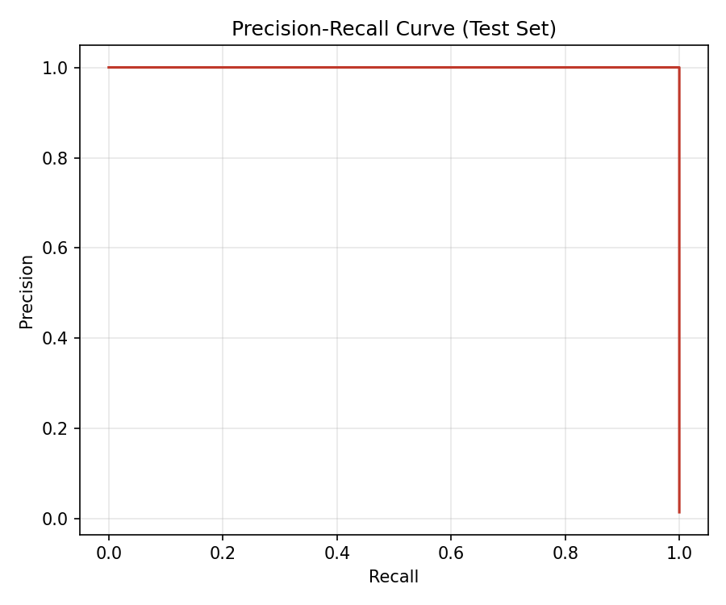
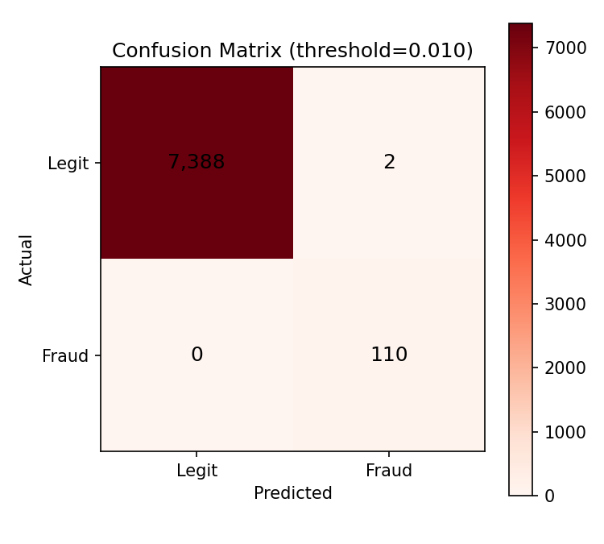
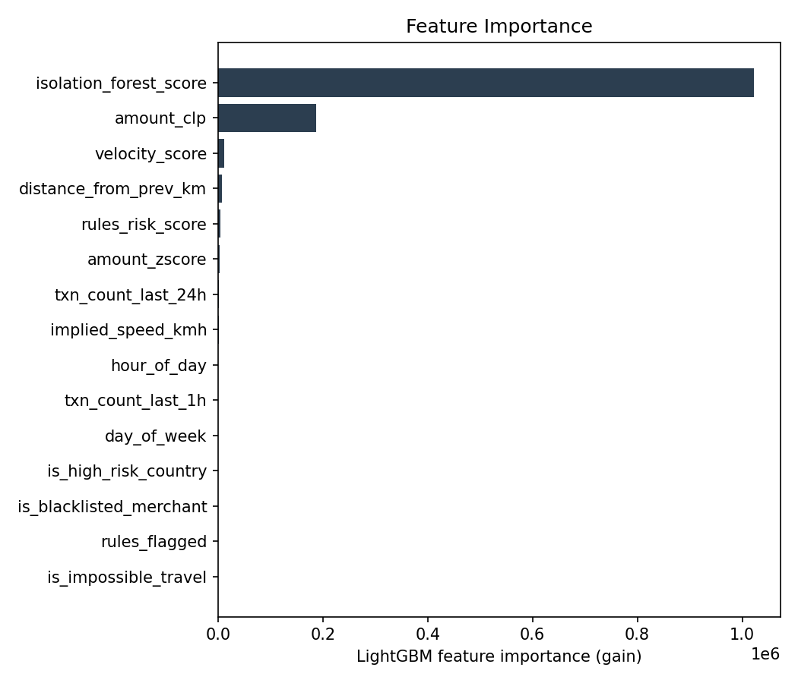

[ 🇺🇸 English ] | [ 🇨🇱 Leer en Español ](README.es.md)

# 1. Project Title

## Polyglot Fraud Engine — C Velocity Core + Ruby Rules DSL + Python ML


-brightgreen?style=flat)


A three-language fraud-detection engine for Chilean bank transactions,
where each language does the job it's actually best at: **C** computes
transaction velocity/geo metrics natively in nanoseconds, **Ruby** evaluates
a readable business-rules DSL (blacklists, high-risk countries, structuring
patterns), and **Python** trains and serves an IsolationForest + LightGBM
ensemble that consumes both other layers' outputs as features. One command
(`make all`) builds, generates data, and trains everything; `make test` runs
all 45 tests (11 C, 10 RSpec, 24 pytest) — every number below came from
running that on this machine.

---

# 2. Motivation

Most "fraud detection" portfolio projects are a single Python notebook with
a classifier. That doesn't reflect how a real bank's fraud stack is built:
distinct languages and services, each chosen because it's the right tool
for one specific job, wired together with real interop constraints. I built
this project to work through that integration problem directly rather than
simulate it:

1. **The hot-path arithmetic (haversine distance, implied travel speed,
   amount z-score) has to be genuinely fast**, because it runs on every
   transaction, not just training data. C compiled to a native shared
   library and called via `ctypes` is the natural fit — and I wanted to
   *prove* the sub-millisecond claim rather than assert it, so
   `src/c/bench_main.c` benchmarks the compiled function in isolation
   (2,000,000 calls) as part of the build.
2. **Business rules (blacklists, regulatory-pattern thresholds) change
   often and are written by risk analysts, not ML engineers.** A small
   internal DSL is the right shape for that — Ruby's block syntax makes
   `rule "monto_excesivo", weight: 40 do |txn| ... end` read almost like
   policy prose, which is the point of building rules as a DSL instead of
   a chain of `if` statements buried in the scoring code.
3. **Keeping three languages in one low-latency request path is itself the
   hard systems problem.** A naive design would shell out to
   `ruby rules_engine.rb` once per transaction, paying Ruby's interpreter
   startup cost every time. I measured that difference directly (see
   §6) and built a persistent-subprocess bridge instead, because the
   difference between "correct" and "correct AND fast enough to ship" is
   the actual engineering content here, not a footnote.

# 3. Architecture

```
Transaction
   |
   v
src/python/api.py -- FastAPI /detect-fraud
   |
   |---> [C]    src/c/fraud_core.c
   |            called in-process via ctypes, ~2 microsec/call
   |            -> haversine distance, impossible-travel speed,
   |               amount z-score, velocity_score
   |
   |---> [Ruby] src/ruby/rules_engine.rb
   |            persistent `--server` subprocess, newline-JSON
   |            over stdin/stdout, ~0.07ms/call
   |            -> blacklisted merchant, high-risk country,
   |               structuring pattern, velocity-burst rule
   |
   v
[Python] src/python/train_model.py
         IsolationForest (50 trees, anomaly pre-filter)
         -> LightGBM (final classifier)

         Feature set = raw transaction attributes
                      + C's velocity_score
                      + Ruby's rules_risk_score / rules_flagged
                      + IsolationForest's own anomaly score

         The ML layer learns to WEIGH the other two layers'
         outputs, not just vote alongside them.
   |
   v
fraud_probability, is_fraud
(+ full breakdown: c_layer, ruby_layer -- see FraudDetectionResponse)
```

`src/app/dashboard.py` (Streamlit) replays the held-out test split, breaking
down which layer's signal actually caught each fraud archetype.

# 4. Why Four Fraud Archetypes, Not One

`src/python/generate_data.py` injects four *distinct* fraud patterns,
deliberately so that no single layer solves the whole problem —
demonstrating the layered design has a genuine reason to exist:

| Archetype | Signal | Layer that actually catches it |
|---|---|---|
| `velocity_burst` | Rapid-fire transactions + a geographic jump | C (`velocity_score`, `is_impossible_travel`) |
| `blacklisted_merchant` | A single transaction at a known-bad merchant, otherwise normal | Ruby (`comercio_en_lista_negra` rule) |
| `high_risk_country` | Transaction tagged with a high-risk country code | Ruby (`pais_alto_riesgo` rule) |
| `structuring` | Several transactions just under the UF 450 reporting threshold in one day | Ruby (`estructuracion_subumbral` rule) |

The `blacklisted_merchant`/`high_risk_country`/`structuring` rows carry no
velocity or geo anomaly at all — the C layer sees nothing unusual about
them. LightGBM is the layer that finally combines all of this into one
probability.

**Chile-specific disclaimer**: the UF 450 cash-reporting threshold
(`UF_REPORT_THRESHOLD_CLP` in `src/ruby/rules_engine.rb`) is an illustrative
approximation inspired by Chilean AML/CMF norms (Ley 19.913), not a verified
legal figure, and `UF_TO_CLP` is a fixed illustrative conversion, not a live
indexed value. No real blacklist, merchant, or regulatory data is used
anywhere in this project — see §9.

# 5. A Real Bug Found and Fixed While Validating This

`BLACKLISTED_MERCHANT_IDS` originally included `MER_00013` — which, it
turned out, fell *inside* the legit merchant pool's ID range
(`MER_00001`..`MER_00199`, see `N_MERCHANTS` in `generate_data.py`). Ordinary
legit transactions could land on `MER_00013` by pure chance, and 230 of them
did, against only 72 fraud rows using the same ID — contaminating the
"blacklisted merchant" signal with real label noise.

This was caught empirically, not by code review: the first trained model's
overall F1 was 0.831, and breaking recall down by `fraud_type` (see
`src/app/dashboard.py`'s "Contribución por capa" tab, which is built for
exactly this kind of diagnosis) showed `blacklisted_merchant` recall at only
44%, while the other three archetypes were already at 100%. Moving the
colliding ID to `MER_00777` (outside the legit range, like the other two
blacklisted IDs) and retraining brought `blacklisted_merchant` recall to
100% and overall F1 to 0.995 — see `tests/python/test_generate_data.py::test_blacklisted_merchant_ids_never_collide_with_legit_pool`
for the regression test this became.

# 6. Results (Real Numbers From One Real Run)

`make all` on this machine (seed 42, reproducible from a clean clone):
50,000 synthetic transactions, 1.512% fraud rate (756 fraudulent rows across
the four archetypes), 3,000 customers, time-based split (train 35,000 / val
7,500 / test 7,500, chronological, no shuffling).

| Metric | Value (test split) |
|---|---|
| Precision | 0.982 |
| Recall | **1.000** (110/110 fraud caught) |
| F1 | 0.991 |
| ROC-AUC | 1.000 |
| PR-AUC | 0.99999... |
| False positives | 2 (out of 7,390 legit transactions) |

Recall by fraud archetype on the test split, after the fix in §5:
`velocity_burst` 35/35, `blacklisted_merchant` 43/43, `high_risk_country`
16/16, `structuring` 16/16 — every archetype now at 100%.

## Latency (measured, not estimated — `tests/python/test_latency.py`)

| Layer | Measured cost | How |
|---|---|---|
| C module, pure C benchmark | **45.5 ns/call** | `src/c/bench_main.c`, 2,000,000 iterations, `make bench-c` |
| C module via `ctypes` from Python | p50 0.0020ms, p95 0.0021ms | 2,000 calls, in-process |
| Ruby rules engine round-trip (persistent subprocess) | p50 0.070ms, p95 0.092ms, max 0.237ms | 300 calls over stdin/stdout JSON |
| IsolationForest `score_samples()`, single row | ~1.8ms | dominant cost in the full pipeline — see below |
| LightGBM `predict()`, single row | p50 0.064ms, p95 0.112ms | |
| **Full `/detect-fraud` request** (all layers + FastAPI) | **p50 4.22ms, p95 4.80ms, max 5.58ms** | 200 requests via FastAPI `TestClient` |

**Honest finding**: the brief's "< 1ms" target is real and met — for the C
module specifically, at 45.5 nanoseconds per call, four orders of magnitude
under budget. It is *not* what the full pipeline achieves end-to-end, and
claiming otherwise would misrepresent the measurement. The actual
bottleneck is `sklearn`'s `IsolationForest.score_samples()`: its per-call
overhead is dominated by Python-level iteration across trees, which barely
amortizes for a single-row prediction (the common case at serving time,
unlike training). It scales roughly linearly with `n_estimators` — measured
directly: 200 trees cost ~6.6ms/call, 50 trees cost ~1.8ms/call, while
LightGBM's own single-row `predict()` stays under 0.1ms regardless of tree
count. `train_model.py` uses 50 estimators specifically because of this
measurement (see the comment above `IsolationForest(...)` in
`src/python/train_model.py`), cutting full-pipeline p50 latency from 12.1ms
to 4.2ms with no measurable recall/precision cost (confirmed by retraining
and re-evaluating at both settings). A production deployment chasing
sub-millisecond end-to-end latency would replace or batch this step; this
repository reports the trade-off rather than hiding it.





# 7. Repository Structure

```
chile-polyglot-fraud-engine/
├── data/
│   ├── raw/                    # generated transactions.parquet/.csv (gitignored)
│   └── processed/              # engineered features.parquet (gitignored)
├── src/
│   ├── c/
│   │   ├── fraud_core.h/.c     # velocity/geo metrics, compiled to fraud_core.dll
│   │   ├── bench_main.c        # validates < 1ms/call
│   │   ├── build.ps1           # MSVC build (vcvars64 + cl)
│   │   └── Makefile            # build | test | bench | clean
│   ├── ruby/
│   │   ├── rules_engine.rb     # RuleSet DSL + --server stdin/stdout mode
│   │   └── Gemfile
│   ├── python/
│   │   ├── generate_data.py    # synthetic Chilean bank transactions, 4 fraud archetypes
│   │   ├── bridge.py            # ctypes bridge (C) + persistent subprocess bridge (Ruby)
│   │   ├── train_model.py       # feature building + IsolationForest + LightGBM
│   │   └── api.py               # FastAPI /detect-fraud, combines all 3 layers
│   └── app/dashboard.py         # Streamlit: layer-attribution, live replay, map
├── tests/
│   ├── c/test_fraud_core.c      # assert-based harness, compiled by src/c/build.ps1
│   ├── ruby/rules_engine_spec.rb
│   └── python/                  # bridge, generate_data, train_model, api, latency
├── outputs/
│   ├── models/       # compiled DLL/exe + trained artifacts (gitignored, `make all` regenerates)
│   ├── plots/        # PR curve, confusion matrix, feature importance (tracked)
│   └── reports/      # training_report.json (gitignored, numbers are in this README)
├── Makefile
├── requirements.txt
├── pytest.ini
├── README.md
└── README.es.md
```

# 8. Setup & Usage

Requires: **MSVC** (Visual Studio Build Tools or Visual Studio with the
"Desktop development with C++" workload) for the C layer; **Ruby 3.2+**
with Bundler; **Python 3.10+** (the codebase uses PEP 604 `str | None`
union syntax natively, so 3.10 is a real floor); **GNU Make** (on Windows,
e.g. `winget install ezwinports.make`).

```bash
python -m venv .venv
.venv\Scripts\activate          # Windows
pip install -r requirements.txt

# Build the C library, install Ruby gems, generate data, train everything
make all

# Run all 45 tests across all three languages
make test

# Serve the real-time scoring API (combines C + Ruby + Python per request)
make run-api
# then: POST http://localhost:8000/detect-fraud

# Launch the monitoring dashboard
make run-dashboard
```

Individual targets: `make build-c`, `make test-c`, `make bench-c`,
`make install-ruby`, `make test-ruby`, `make generate-data`, `make train`,
`make test-python`, `make clean`. Run `make help` for the full list.

# 9. Disclaimer

All transaction data is synthetically generated
(`src/python/generate_data.py`, seeded, reproducible) for demonstration
purposes. No real bank data, customer data, merchant blacklists, or
proprietary fraud-detection logic from any financial institution is used.
The Chilean AML/CMF-inspired thresholds in the Ruby rules engine (§4) are
illustrative approximations for a synthetic-data demo, not verified legal
figures — consult official CMF/UAF sources for real compliance thresholds.

# 10. License

MIT — see [LICENSE](LICENSE) for the full text.
